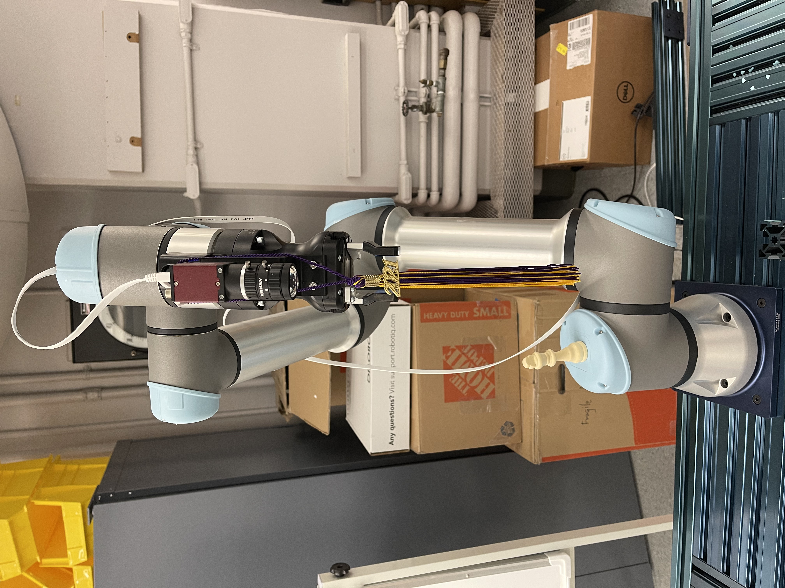
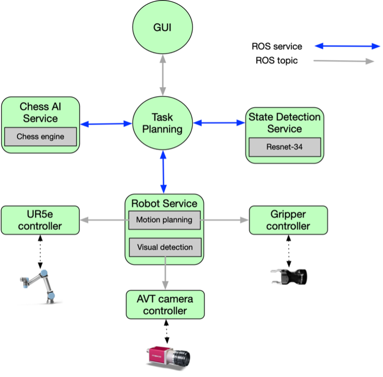
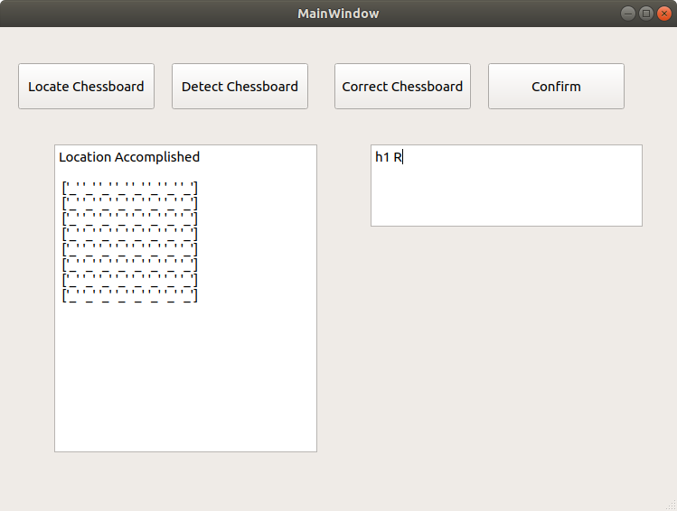

# UR5e Robotic Chess Player

# Description
The ***UR5e robotic chess player*** is an autonomous system that drives an industrial collaborative 
robotic arm through visual information obtained from a camera to play physical chess against a human.

The challenges for robotic arms operating on a production line include **detection**, **decision**, and **reaction**. 
These challenges are amplified in making a robotic arm that interactively plays chess with a human.
Developing this robotic system to play chess has given insights into solving problems in
[the application of robotic manipulators to manufacturing inspection](https://arminstitute.org/project-highlight-defect-inspection/).

## Major functions and limitations
1. **3D visual perception based on 2D imaging feedback:** able to detection the position and orientation of the chessboard in the workspace and on the fly\
**limitation:** The entire chessboard needs to be inside the view of the camera at the standby position and better without any pieces on the board. In other words, the robot needs to see the chessboard fully, otherwise the pose estimation may fail.
2. **Visual situational awareness:** able to detection the chessboard state every time a player makes a move\
**limitation:** The accuracy of the built-in neural network is 97% so it is not bullet proof to errors; the detection result at the beginning of the game needs human check: if the majority of a chess piece is poorly placed outside the containing square, the detection will fail.
3. **Physical manipulation intelligence:** able to move every chess piece from a start square to an end square at each step, and to compete against a human player with world-class chess analysis\
**limitation:** The system does not detect the exact position of a chess piece inside a square. All pieces are gripped in the same way.

## Hardware
* Universal Robot UR5e collaborative robot
* Robotiq Hand-e gripper
* Allied Vision Mako camera *(mounted on the robotic arm)*


## Software
The current software system was developed and tested in Ubuntu 18.04 with ROS melodic. The software works for the hardware listed above out of the box, but can be modified to fit different or more hardware for future 
development. 

* UR5e controller: driver for the UR5e manipulator.
* Gripper controller: driver for the Robotiq HandE controller.
* AVT camera controller: driver for the AVT camera.
* Manipulation node: motion planning for manipulation taks.
* Board state detection: running CNN model for piece classification.
* Task planning: high-level task planning node.
* GUI: graphical user interface node.

# Getting started

## Installation: install dependencies
### 1. Install ROS and create a workspace.
Follow the [ROS melodic installation](http://wiki.ros.org/melodic/Installation/Ubuntu) to download the ROS.\
Follow the [Installing and Configuring Your ROS Environment](http://wiki.ros.org/ROS/Tutorials/InstallingandConfiguringROSEnvironment) to create a ROS workspace using `catkin`

### 2. Install AVT camera driver
Go to the [official website](https://www.alliedvision.com/en/products/vimba-sdk/#c1497). Download `Vimba_v5.0_Linux` driver and extract it in the `Home` directory. 
Look inside the folder named VimbaGigETL, run `Install.sh` file from command line. After installation, log off once to activate the driver.

Please use `VimbaViewer` to test if your camera has been properly configered and is discoverable. The `VimbaViewer` can be found inside the extracted dowload folder's `Tools/Viewer/Bin/x86_64bit` folder. If you cannot open the camera and grab images using `VimbaViewer`, this ROS wrapper will fail, too.

More information is available in this [seperate package](https://github.com/macs-lab/avt_camera#usage).

### 3. Install Python3
Python 3.6 or newer is requred to install for using `pytorch` and `pyqt5`.
```bash
# check which python3 version in the system. If you have already install python3 version >= 3.6, you are good to go.
$ python3 --version
# If the above command shows an error, or you have python3 version < 3.6, install/reinstall python3
$ sudo apt-get install software-properties-common
$ sudo apt-get update
$ sudo apt-get install python3.6
```

### 4. Install needed python library and software
* Python library:
```bash
$ python -m pip install --user numpy scipy pytransform3d opencv-python==4.2.0.32
$ python3 -m pip install PyQt5 opencv-python-headless rospkg numpy chess
$ sudo apt-get install ros-melodic-cv-bridge ros-melodic-image-transport ros-melodic-ros-controllers 
  ros-melodic-moveit
```
* PyTorch:\
Follow the PyTorch [GET STARTED](https://pytorch.org/get-started/locally/) to download the pyrotch

### 5. Install cv_bridge for python3 to communicate between ROS and OpenCV
* Download dependency
```bash
$ sudo apt-get install python3-pip python-catkin-tools python3-dev python3-numpy
$ sudo pip3 install rospkg catkin_pkg
```
* Create workspace and clond package
```bash
$ mkdir -p ~/cvbridge_build_ws/src
$ cd ~/cvbridge_build_ws/src
$ git clone -b melodic https://github.com/ros-perception/vision_opencv.git
```
* Compilation
```bash
$ cd ~/cvbridge_build_ws
$ catkin config -DPYTHON_EXECUTABLE=/usr/bin/python3 -DPYTHON_INCLUDE_DIR=/usr/include/python3.6m -DPYTHON_LIBRARY=/usr/lib/x86_64-linux-gnu/libpython3.6m.so
$ catkin config --install
$ catkin build cv_bridge
```

## Installation: Git clone packages and drivers for *UR5e robotic chess player*
```bash
$ cd ~/catkin_ws/src

# clone `avt_camera` package
$ git clone https://github.com/macs-lab/avt_camera.git

# clone `robotiq_hande_ros_driver` package
$ git clone https://github.com/macs-lab/robotiq_hande_ros_driver.git

# clone `robotic_chess_player` package
$ git clone https://github.com/macs-lab/robotic_chess_player.git

# build
$ cd ~/catkin_ws
$ catkin_make
```

## Setting Up

### 1. Setting up the camera driver
Make sure the `cam_IP` parameter in the camera launch file (robotic_chess_player/launch/camera_bringup_freerun.launch) match with the actual camera IP adress. 

To test if the camera driver is working properly, do the following:
* launch camera in free run mode.
```bash
$ roslaunch robotic_chess_player camera_bringup_freerun.launch
```
* use [`rqt_image_view`](http://wiki.ros.org/rqt_image_view) to see image output.
```bash
$ rosrun rqt_image_view rqt_image_view
```

### 2. Setting up gripper controller
Go to `gripper_bringup.launch`. Modify the parameter `robot_ip` to the actual IP address for the UR robot. 

To test if the gripper controller is working properly, launch `gripper_bringup.launch` and run `test.py` inside the `robotiq_hande_ros_driver` pakcage:
```bash
# launch gripper driver
$ roslaunch robotiq_hande_ros_driver gripper_bringup.launch
# open a new bash, run
$ rosrun robotiq_hande_ros_driver test.py
# you should see the gripper moving.
```

### 3. Camera calibration and hand-eye calibration
**This step directly affects the pose estimation accuracy! Do the calibration when switching the camera or changing the camera's focal length.**\
Use [camera_hand_eye_calibration](https://github.com/xiaohuits/camera_hand_eye_calibration) to obtain the `camera_hand_eye_calibration.yaml` file. 
This file contains the camera calibration results as well as the hand-eye pose.
Copy the file and paste it into `/robotic_chess_player/config` folder.

### 4. Chessboard's square length and compensation of z direction's error 
* The currently used chessboard is 0.043 meters wide for each of its squares. 
* The pose estimation result has a certain amount of error in the z-direction, so compensation needs to be added to the z-direction. The current compensation value is -0.156 meters. A more negative value means the gripper is raised further away from the chessboard surface and vice versa. 
* The square's length and compensation are manually typed and saved in the `camera_hand_eye_calibration.yaml` file. The format of saving these parameters is shown below.
```
parameter:
  # chessboard square's length 
  edge: 0.043
  # compensation of pose estimation error in z direction
  height: -0.156
```
**Please keep the format and adjust the values if a new chessboard is used. Remember, the unit is in meters.**
* The process of getting the proper compensation value will be elaborated in the **Usage** section

# Usage
## Start the entire system 
### 1. Bring up the UR5e robot driver in lab B012
* Power on the robot, with the robot's base mounted on the workspace's surface. Load the installation program,`right_arm_ros_upright.installation`, on the robot's polyscope. For more detail information about how to load or create a new installation file, please check [Universal Robot e-Series User Manual, section 21, file manager](https://s3-eu-west-1.amazonaws.com/ur-support-site/40974/UR5e_User_Manual_en_US.pdf)
* Open a terminal and initiate the driver by following the manual: [Running Universal_Robots_ROS_Driver in a separate machine](https://github.com/macs-lab/lab_doc/wiki/Running-Universal_Robots_ROS_Driver-in-a-separate-machine).
* Run the external control program (external_control.urp) on the robot. Back to the terminal, you should see message similar to `robot is ready to receive control command`. If the polyscope does not have the external_control.urp in the folder, follow this instruction: [Installing a URCap on a e-Series robot](https://github.com/UniversalRobots/Universal_Robots_ROS_Driver/blob/master/ur_robot_driver/doc/install_urcap_e_series.md)

### 2. Bring up the neural-network chess detection system
Open a new terminal, run:
```bash
$ source ~/cvbridge_build_ws/install/setup.bash --extend
$ rosrun robotic_chess_player chessboard_state_detection.py 
```

### 3. Bring up the entire system:
Open a new terminal, run:
```bash
$ roslaunch robotic_chess_player entire_system_bringup.launch 
```

### 4. System instruction
A GUI windonw will show up after finish step 3 and it looks like the image below.



1. Before placing the chess pieces on the board, click first `Locate Chessboard` to estimate the chessboard pose relative to the robotic arm's base.
2. Place the chess pieces on the board. The human player can now make a move. Then, click `Detect Chessboard` to detect the chessboard state. The result will be shown in the left dialog box.
3. Enter false detections' square and correct piece type in the dialog box on the right and click `Correct Chessboard`. This is needed for only when an error occurs. The formate of the comment is first to specify which square in lowercase, then press space, and enter the correct piece's type. Each type of chess piece is using one letter. Capital letter means white and lowercase letter represents black. Piece type: k(king), q(queen), r(rook), n(knight), b(bishop), p(pawn).
4. Click `Confirm` to make the system search for the best chess move and perform that move through driving the robotic arm.

### 5. Shut down process 
To close the system, just go to every terminal which was opened by following the steps above and hit `Crtl+c`.

## Automatically collecting image data
We built a feature to automatically image the chess board and chess pieces to collect data and train the neural network.
Here, the system positions the camera vertically and right above the center of the chessboard at a particular height to detect the chessboard state. The current automatic image collecting function also takes images at the same position.
1. Bring up UR5e robot driver as shown before
2. Roslaunch partial system:
```bash
$ roslaunch robotic_chess_player partial_system_bringup.launch 
```
3. Bring up rqt:
```bash
$ rosrun rqt_service_caller t_service_caller
``` 
4. Change the server caller topic to `robot_service`, and type in `locate chessboard` in the expression.
5. Place chess piece on the board. 
Place only black or white of one type of chess piece on the board each time. All chess pieces have two pieces except the king for one color, so place two pieces at square h1 and square h2. When collecting the data for the king, just put it at square h1.
6. Type in `auto;`+`corresponding chess piece type letter`  in the expression
For example, `auto;Q` is collecting the white queen's image data 

## Getting proper compensation value for pose estimation error in z-direction
As we have mentioned earlier in Section 5 of the Setting Up section, the pose estimation of the chessboard may require compensation. To do so,
1. Follow the **Automatically collecting image data** instructions from 1 to 4.
2. Type in `to:`+`corresponding chessboard square`  in the expression, for example, `to:h1`. Before hit `call`, slow down the robotic arm's operation speed by using the polyscope so that the robotic arm will not break the surface of the chessboard if the current compensation value is not proper.
3. The robotic arm will move and try to touch the surface of given square. Based on the observation, change the value in the `camera_hand_eye_calibration.yaml` file.
4. Shut down the system and redo the steps above until getting a feasible value.

# References
- neural network model: we use the [transfer learning](https://pytorch.org/tutorials/beginner/transfer_learning_tutorial.html) technique to finetune the Pytorch pre-trained [Resnet-18](https://pytorch.org/vision/stable/models.html) with softmax fully connected layer. The neural network's parameter is saved in the `neural_net` folder.
- chess analysis engine: we use the award-winning open-source [Stockfish](https://stockfishchess.org/) chess engine. The engine is saved in the `chess__ai` folder.
- Multiple motivations were drawn from the Gambit project: Matuszek, Cynthia, et al. "Gambit: An autonomous chess-playing robotic system." 2011 IEEE International Conference on Robotics and Automation, 2011. The Gambit project used 2D and depth cameras and a robot different from the UR5e used in this project. For detecting where the chessboard is in the image, it first detected the points and then found four chessboard corner points using the depth information and trained the RANSAC algorithm. For detecting the pieces on the chessboard, Gambit first used point clouds and depth information to find which square had points above it, and then it cropped the image and used more than one trained SVM algorithm to classify one image about which type and color this piece was. Our project used one 2D camera without the depth information throughout the process, and used one neural network over point clouds, depth information, and SVM. Another difference is the reserach on different lighting that is elaborated in Mingyu Wang's MS thesis.

